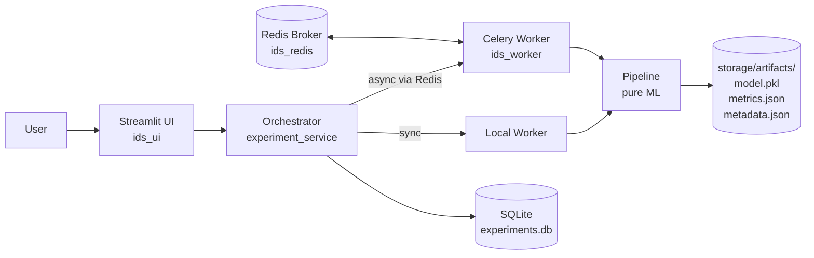

# IDS Research Pipeline Execution System

> A web-based, on-premise platform for **reproducible** machine learning experiments on Intrusion Detection System (IDS) datasets.

[](https://www.python.org/)
[](https://streamlit.io/)
[](https://docs.docker.com/compose/)
[](https://docs.celeryq.dev/)
[](https://scikit-learn.org/)
[](#testing)
[](#academic-context)
[](#license)

---

## Overview

The IDS Research Pipeline Execution System is a **research platform** for running fixed, paper-faithful machine learning pipelines on intrusion detection datasets. It is designed primarily for a single researcher running thesis-grade experiments and was built around one engineering goal: **bit-identical reproducibility** of every reported metric.

Given a CSV/NDJSON dataset and a pipeline selection, the system:

1. Validates the file against a known schema and computes its SHA-256 hash.
2. Trains the model using **locked, hard-coded hyperparameters** (no user-configurable knobs).
3. Evaluates with standard metrics (accuracy, precision, recall, F1, ROC-AUC, confusion matrix). HIKARI2021 pipelines also produce a per-class report and a learning curve; EVE-cbr pipelines instead report a dual-holdout comparison (natural vs balanced).
4. Persists the trained model, all metrics, and metadata to disk under a per-experiment artifact directory.
5. Records the run in a local SQLite database, browsable through a Streamlit UI with downloadable PDF reports.

This is not a production IDS, not a real-time detector, and not a multi-tenant service. It is research infrastructure for controlled, reproducible offline experiments. See [Known Limitations](#known-limitations) below.

---

## Key Features

- **Locked pipelines, no UI hyperparameter tuning.** Every algorithm parameter is hard-coded in source. This is the platform's core methodological contribution.
- **10 registered ML pipelines** across 2 dataset families (see [Pipelines](#pipelines)).
- **Reproducibility by construction**: every stochastic step uses `random_state=42`, every split is `stratify=y`, every dataset is SHA-256 hashed and the hash is persisted to the experiment record.
- **Dual execution modes**: synchronous (in-process `local_worker`) or asynchronous (Celery + Redis). Selected via the `USE_ASYNC` environment variable — **the Docker deployment sets `USE_ASYNC=true`, so containers run asynchronously**; the synchronous path remains in the code for local development and the test suite. The UI does not toggle the mode; it shows an execution-status panel (broker/worker health) and blocks submit if the async worker is unavailable.
- **Web UI (Streamlit)** with 3 pages: **Progress & Status** (the default landing dashboard — live progress of all in-flight experiments + history table with a pop-up result dialog), **Run Experiment** (create/monitor a new run), and **Add Pipeline & Dataset** (the contribution flow: upload, static validation, controlled trial, review and approval, user management).
- **Interactive results in the UI** (confusion matrix, feature importance, ROC, learning curve) plus a **PDF report** per experiment (academic-paper style: numbered captions, muted palette, computed security interpretation, reproducibility block).
- **Containerized deployment** via Docker Compose. Three services: `ids_ui`, `ids_worker`, `ids_redis`.
- **Test suite** of 227 tests (**225 passed, 2 skipped** on a run without the optional EVE NDJSON fixture), including parametrized cross-pipeline reproducibility checks.
- **Cross-environment path fallback** so an experiment dispatched from one OS resolves dataset files correctly on a worker running in another (e.g., Docker worker reading a Windows-style path).

---

## Architecture

The system is best described as **five sequential layers plus a shared kernel**, with one-way import boundaries:

```
        UI  →  Orchestrator  →  Workers  →  Pipelines  →  Storage      (request/execution flow)
              └──────────────  shared kernel: contracts/  +  config/  ──────────────┘
```

| Layer | Directory | Role |
|---|---|---|
| **UI** | `ui/` | Streamlit views (`ui/views/`) + shared result/dashboard components (`ui/components/`); talks to `orchestrator/` + `config/` |
| **Orchestrator** | `orchestrator/` | Validation, dispatch, experiment lifecycle, result read, infra health check |
| **Workers** | `workers/` | `local_worker` (sync, in-process) and `celery_worker` (async task) |
| **Pipelines** | `pipelines/` | Pure ML (HIKARI2021 + EVE-cbr); no DB/UI/worker imports |
| **Storage** | `storage/` | Datasets (input) + artifacts (output) + SQLite DB; mounted as a volume |
| **Shared kernel** | `contracts/`, `config/` | Cross-layer dataclasses (`PipelineInput`/`PipelineResult`, schemas) and settings/registry/Celery config — imported by every layer, so they sit *beside* the stack, not as a sequential step |

Supporting: `database/` (SQLite CRUD + migrations), `utils/` (hashing, artifact saving, PDF generator, sanitizer), `tests/`, `docker/`, and `run_pipeline.py` (CLI runner).

**Hard import rule:** `pipelines/` never imports from `database/`, `ui/`, `orchestrator/`, or `workers/` — only from `contracts/`. **DB writes:** within the orchestrator layer, `orchestrator/experiment_service.py` is the sole writer and the only place that creates a record (INSERT); on the async path `workers/celery_worker.py` also writes status updates (`RUNNING`/`FINISHED`/`FAILED`) from the worker process, and `database/` init (DDL) runs at UI startup.

### Component flow



---

## Pipelines

All pipelines are registered in [`config/pipeline_registry.py`](config/pipeline_registry.py) and follow the `PipelineResult` contract in [`contracts/pipeline_contracts.py`](contracts/pipeline_contracts.py).

### HIKARI2021 (6 pipelines)

All HIKARI2021 pipelines use a stratified 70/30 train/test split.

| Pipeline ID | Algorithm | Preprocessing notes |
|---|---|---|
| `hikari2021.rfc_pipeline` | Random Forest (100 trees) | RandomUnderSampler on train only; StandardScaler fit on balanced train |
| `hikari2021.dt_pipeline` | Decision Tree | None |
| `hikari2021.knn_pipeline` | K-Nearest Neighbors (k=5) | RandomUnderSampler on train only; StandardScaler fit on balanced train |
| `hikari2021.svc_pipeline` | SVC (`probability=True`) | None — UI shows runtime warning (O(n²)); learning curve uses cv=3 |
| `hikari2021.nbgc_pipeline` | Gaussian Naive Bayes | None |
| `hikari2021.lr_pipeline` | Logistic Regression | StandardScaler + PCA(95% variance), both **fit on train only** (no leakage) |

### EVE/Suricata cbr (4 pipelines)

The four EVE pipelines wrap the **`cbr` 14-phase anti-leakage pipeline** (`pipelines/eve_cbr/`) via a shared adapter (`pipelines/eve_cbr/cbr_adapter.py`); only the algorithm differs per pipeline. Analysis is focused on **TLS** traffic, and **metrics are reported on the natural holdout (attack class)** — reflecting the original class distribution.

| Pipeline ID | Algorithm | Notes |
|---|---|---|
| `eve_cbr.rfc`  | Random Forest | 14-phase cbr, TLS, natural-holdout (attack-class) |
| `eve_cbr.dt`   | Decision Tree | idem |
| `eve_cbr.lsvc` | Linear SVC | idem |
| `eve_cbr.xgb`  | XGBoost | idem |

**14-phase chain (grouped):** ingestion & pre-split validation (P1–2) → probing analysis + conservative label refinement with a row-level conversion cap (P3–4) → feature engineering, computed features, cleaning policy (P5–7) → export + stratified train/test split (P8) → visualization + correlation/leakage screening (P9–10) → modeling-split prep + feature selection MI/RFE/PCA, train-only (P11–12) → balanced-train training + **dual holdout** natural (primary) + balanced (secondary) evaluation (P13–14). Labels are **derived from Suricata alerts** (`Target` refined from `alert.severity`) — not external ground truth.

> The legacy 7/9-phase `eve_suricata.*` pipelines were archived (recoverable) under `pipelines/_archive/eve_suricata_7phase/` and are no longer registered.
>
> XGBoost is a soft dependency; if unavailable, only `eve_cbr.xgb` is affected.

---

## Tech Stack

| Layer | Technology |
|---|---|
| UI | Streamlit, streamlit-option-menu, streamlit-aggrid |
| ML | scikit-learn, imbalanced-learn, XGBoost (optional) |
| Async execution | Celery + Redis (broker & result backend) |
| Persistence | SQLite (stdlib `sqlite3`, WAL mode), filesystem artifacts |
| Reporting | ReportLab (PDF), matplotlib |
| Packaging | `pip install -e .` via `pyproject.toml`; Python ≥ 3.10 |
| Container runtime | Docker + Docker Compose v2; Python 3.11-slim base image |

Full dependency list lives in [`requirements.txt`](requirements.txt).

---

## Runtime Environment

This section replaces the former **Environment Info** UI page (removed from the app; the same information now lives here and in each experiment's `metadata.json`).

The platform runs on **Python 3.11** (the `python:3.11-slim` Docker base image; local development supports Python 3.10 or 3.11). Verified library versions from the running containers:

| Component | Version (verified in the running images) |
|---|---|
| Python | 3.11.15 |
| scikit-learn | 1.9.0 |
| pandas | 3.0.3 |
| numpy | 2.4.6 |
| Streamlit | 1.59.1 |
| Celery | 5.6.3 |
| Platform | Linux (WSL2) inside Docker |

**Two Docker images, identical dependency set.** The stack builds two images — the UI (`docker/Dockerfile`) and the Celery worker (`docker/worker.Dockerfile`) — but **both install from the same [`requirements.txt`](requirements.txt)**, so their library versions match. Verified: `ids_ui` and `ids_worker` report identical `scikit-learn 1.9.0 / pandas 3.0.3 / numpy 2.4.6` (no version drift between images). Exact versions are pinned by the ranges in `requirements.txt` and resolved at image-build time, so they can drift within those bounds between separate builds — rebuild both images together to keep them in lockstep.

**Checking the runtime versions of a given experiment.** Every experiment records its full environment in its artifact `metadata.json` under the `environment` key — Python version, scikit-learn / pandas / numpy versions, platform string, and Docker status. Inspect it with, e.g.:

```powershell
# View the environment block captured for one experiment
type storage\artifacts\<experiment_id>\metadata.json
```

To read the live versions from a running container:

```powershell
docker compose exec ui python -c "import sys, sklearn, pandas, numpy; print(sys.version); print('sklearn', sklearn.__version__, '| pandas', pandas.__version__, '| numpy', numpy.__version__)"
```

**Docker note.** Running the stack via `docker compose up` isolates these versions inside the image, which is what makes every recorded metric reproducible on another machine: as long as the Docker image (hence library versions), the pipeline code, and the dataset SHA-256 hash match, the results are bit-identical. Running locally (non-Docker) uses whatever versions are installed in your virtual environment, so pin them against `requirements.txt` if you need to match a recorded run.

---

## Deployment hardening

Bawaan repositori ini ditujukan untuk **jaringan lab tepercaya**. Sebelum
memasangnya di tempat yang dapat dijangkau orang lain, kerjakan daftar ini.

### 1. Admin pertama (WAJIB)

Tidak ada password bawaan. Buat `.env` di sebelah `docker-compose.yml`:

```
ADMIN_USERNAME=admin
ADMIN_PASSWORD=<sandi kuat, minimal 8 karakter>
```

Bila `ADMIN_PASSWORD` kosong, **tidak ada admin yang dibuat** dan halaman
login mengatakan apa yang harus disetel. Itu disengaja: default lemah yang
tertulis di repositori lebih buruk daripada tidak ada admin sama sekali.

### 2. Cadangan (WAJIB)

Artefak eksperimen **tidak dapat dibuat ulang**: menjalankan ulang sebuah
eksperimen menghasilkan baris baru, bukan artefak lama yang kembali.

```bash
python scripts/backup.py                    # ke ./backups/
python scripts/backup.py --out /mnt/nas --keep 7
```

Basis data disalin lewat **API backup sqlite3**, bukan salinan berkas: dengan
`journal_mode=WAL`, menyalin `.db` saat ada penulisan menghasilkan salinan
yang kehilangan transaksi yang masih berada di berkas `-wal`. Aman dijalankan
selagi stack menyala. `storage/datasets/` sengaja tidak ikut (berukuran giga
dan berasal dari sumber aslinya); ringkasannya menyebutkan hal itu.

Jadwalkan lewat Task Scheduler / cron.

### 3. HTTPS

Streamlit berbicara HTTP polos, jadi tanpa lapisan ini sandi melintas
jaringan apa adanya — termasuk sandi Research Admin.

```bash
docker compose --profile proxy up -d        # HTTPS di :443
```

Lalu **hapus blok `ports:` pada service `ui`** supaya tidak ada jalan memutar
lewat HTTP. Untuk domain publik, sunting `docker/proxy/Caddyfile`: ganti
`:443` dengan nama domainnya dan hapus `tls internal`.

### 4. Menutup akses jalankan

Bawaannya siapa pun boleh menjalankan eksperimen. Di internet terbuka itu
berarti antrean dapat dipenuhi orang asing (worker berpagu 3,5 GB,
concurrency 1):

```
REQUIRE_LOGIN_TO_RUN=true
```

### 5. Non-root (host Linux)

```bash
docker compose build --build-arg RUN_AS=app
sudo chown -R 10001:10001 ./storage
```

Bawaannya `root` **khusus untuk Docker Desktop di Windows**: bind-mount di
sana dipasang lewat 9p dengan `uid=0;gid=0`, sehingga pengguna non-root gagal
menulis `experiments.db` dengan *"attempt to write a readonly database"*.
Opsi mount itu milik integrasi WSL Docker Desktop dan tidak dapat diubah dari
compose.

### Pindah ke mesin server

Langkah demi langkah ada di [`docs/MIGRASI.md`](docs/MIGRASI.md), termasuk
urutan cadangan-lalu-pulih dan verifikasi setelah start.

### 6. Pembatas beban dan pemantauan

Ketiga service punya `healthcheck` dan rotasi log (10 MB x 3) secara bawaan.
Periksa dengan `docker compose ps`; ketiganya harus `(healthy)`.

Pembatas beban aktif secara bawaan dengan nilai longgar: maksimal 3 run aktif
per orang, dan 20 run per 10 menit. Pada pemakaian lab tak seorang pun akan
menyentuhnya. Untuk pemasangan publik, turunkan lewat `.env`:

```
MAX_ACTIVE_RUNS_PER_OWNER=2
MAX_RUNS_PER_WINDOW=10
RUN_WINDOW_MINUTES=10
```

Nilai `0` mematikan pembatasnya. Pengunjung tanpa akun berbagi SATU ember:
tanpa identitas, tidak ada cara membedakan sepuluh orang dari satu orang yang
menekan sepuluh kali.

### Yang TIDAK dilakukan

* Redis tidak lagi dipublikasikan ke host (ia broker Celery tanpa
  autentikasi). Untuk menengoknya: `docker compose exec redis redis-cli ping`.
* Tidak ada batas laju maupun kuota per pengguna. Pada jaringan terbuka,
  gabungkan langkah 3 dan 4.
* Pagu memori 3,5 GB adalah batas nyata: dataset besar ditolak di muka oleh
  `dataset_ram_blocker`, bukan dibiarkan gagal di tengah jalan.

## Prerequisites

- **Docker** (recommended) — Docker Desktop with Compose v2, or Docker Engine + Compose.
- Sufficient memory available to the Docker backend. Recommended: **≥ 8 GB** for HIKARI2021 (ALLFLOWMETER variant is ~302 MB CSV and learning-curve fitting is memory-intensive). On WSL2, configure via `%USERPROFILE%\.wslconfig`.
- Disk: ≥ 5 GB free for image build + artifact storage; more if you run many experiments.

For local (non-Docker) development:

- Python 3.10 or 3.11
- Redis (only if running async mode locally)

---

## Getting Started (Docker — recommended)

```powershell
# 1. Clone
git clone <your-repo-url>
cd <repo>

# 2. Place dataset files
#    See "Preparing Datasets" below. storage/datasets/ is mounted into both containers.

# 2b. Set the first admin account (see "Authentication" below)
#     Create a .env file next to docker-compose.yml — never commit real passwords:
#       ADMIN_USERNAME=admin
#       ADMIN_PASSWORD=<a strong password, at least 8 characters>

# 3. Build the images
docker compose build

# 4. Start the stack
docker compose up -d --remove-orphans

# 5. Open the UI
#    Streamlit runs on http://localhost:8501
```

`--remove-orphans` is recommended on every start: it cleans up auto-named containers from previous runs that share the same image but have no Compose service binding.

Useful follow-ups:

```powershell
# Tail worker logs
docker compose logs -f worker

# Inspect what env the worker process actually sees
docker compose exec worker env | findstr CELERY

# Stop everything
docker compose down
```

After any code change, rebuild the images so the running containers pick up the change (Dockerfiles use `COPY . .`, source is baked at build time):

```powershell
docker compose down
docker compose build --no-cache
docker compose up -d --remove-orphans
```

---

## Getting Started (Local — Python venv, no Docker)

For developers iterating on UI or pipeline code locally:

```powershell
python -m venv venv
.\venv\Scripts\activate          # PowerShell on Windows
pip install -r requirements.txt
pip install -e .                  # makes the package importable everywhere

streamlit run ui/app.py           # synchronous mode (USE_ASYNC unset / false)
```

Async mode locally requires Redis on `localhost:6379`. The default broker URL in [`config/celery_config.py`](config/celery_config.py) is `redis://localhost:6379/0`, overridden in Docker by `CELERY_BROKER_URL=redis://redis:6379/0`.

---

## Authentication

The platform opens **without a login**. Protection is *per action*, not per
access: reading results and running experiments are open to everyone; adding
code or data — and approving it — requires an account.

| | Visitor (not signed in) | Kontributor | Research Admin |
|---|---|---|---|
| View every experiment | ✔ | ✔ | ✔ |
| Run an experiment | ✔ | ✔ | ✔ |
| Cancel / re-run | ✔ | ✔ | ✔ |
| Upload dataset or pipeline | ✖ | ✔ | ✔ |
| Approve uploads *(phase 3)* | ✖ | ✖ | ✔ |
| Manage users | ✖ | ✖ | ✔ |

### Getting an account

Anyone can request one: press **Daftar** at the bottom of the sidebar, next to
**Masuk**. The account is created immediately but starts **pending**:

```
Daftar  →  status "pending" (nol hak)  →  Research Admin mengaktifkan  →  Kontributor
```

A pending account may sign in — so its owner can see that the request is
waiting — but it has **no rights at all**: it cannot upload and cannot approve,
exactly like a visitor. Sign-up always produces the `contributor` role; the
`research_admin` role is only ever granted by another Research Admin from
**Kelola Pengguna**, never through the sign-up form.

A Research Admin activates accounts in **Add Pipeline & Dataset → Kelola
Pengguna**, which lists every waiting request with its username, sign-up time,
and stated purpose, and offers **Aktifkan** or **Tolak**. Who approved an
account and when is recorded. A Research Admin cannot disable their own account.
Experiments run without signing in are stored with `owner = NULL` and shown as
"sistem", exactly like the records that predate authentication. **No view is
ever filtered by owner** — everyone sees every experiment.

Sign in from the **bottom of the sidebar**: it shows "Mode pengunjung" with a
**Masuk** button, or your username, role, and a **Keluar** button once signed
in. Permission checks live in one place (`orchestrator/auth_service.py`) and are
enforced both in the UI and inside the action functions themselves, so a hidden
button is never the only thing standing in the way.

### First Research Admin

The first Research Admin is created at startup from environment variables. No
password is ever hardcoded:

| Variable | Default | Notes |
|---|---|---|
| `ADMIN_USERNAME` | `admin` | Optional |
| `ADMIN_PASSWORD` | *(none)* | Required to create the account, min. 8 characters |

```powershell
# Docker: put these in a .env file beside docker-compose.yml (do not commit it)
ADMIN_USERNAME=admin
ADMIN_PASSWORD=<strong password>

# Local venv (PowerShell)
$env:ADMIN_PASSWORD = "<strong password>"
streamlit run ui/app.py
```

If `ADMIN_PASSWORD` is not set, **no account is created** — the app logs a
warning and the login page tells you to set it. A weak default account is never
created. Seeding is idempotent: an existing admin is never overwritten, so
changing `ADMIN_PASSWORD` later does **not** reset the password.

### Logging in

Open the sidebar, press **Masuk** at the bottom, and enter username and
password. Failed attempts show a generic "Username atau password salah" so the
form never reveals whether a username exists. Signing in or out never touches
experiment data or a run in progress.

Passwords are stored as PBKDF2-HMAC-SHA256 with a random per-user salt and
260,000 iterations (`orchestrator/auth_service.py`) — never in plain text, and
never written to logs.

### Security limitations (read this)

This is authentication for an **internal, controlled deployment** — not a
public-facing application:

- Streamlit has no real server-side session store. The signed-in identity lives
  in `st.session_state`, so **refreshing the page logs you out** and the login
  state is per browser tab. No cookies or persistent tokens are used.
- Streamlit provides no CSRF protection, and the container image sets
  `enableXsrfProtection = false`.
- There is no transport encryption by default; put the app behind a reverse
  proxy with TLS if it is reachable beyond localhost.
- Because anyone can run experiments without signing in, the compute budget is
  open to whoever can reach the app — another reason to keep it on an internal
  network.
- Uploaded pipelines are validated statically and staged for review; they are
  **not** activated automatically. Registering them stays a manual, reviewed
  code change.

---

## Preparing Datasets

Datasets are read-only inputs at runtime — the UI does **not** include a file uploader. Place files directly in `storage/datasets/` before starting the stack:

```
storage/datasets/
├── ALLFLOWMETER_HIKARI2021.csv
└── eve_100k.json                 # NDJSON (one JSON object per line)
```

Supported file formats per dataset type (from [`contracts/dataset_schemas.py`](contracts/dataset_schemas.py)):

- **HIKARI2021** — `.csv` (ALLFLOWMETER variant), 88 columns including `traffic_category` and `Label`.
- **EVE_SURICATA** — `.json` NDJSON (one JSON object per line). Required top-level keys: `timestamp`, `flow_id`, `event_type`, `src_ip`, `src_port`, `dest_ip`, `dest_port`, `proto`. Binary label `Target` is derived inside the pipeline from `alert.severity`.

Dataset files are **never written to** at runtime. They are hashed (SHA-256) and read into memory only.

---

## Usage

### Via the Streamlit UI

1. Open **http://localhost:8501**. The default page is **Progress & Status**.
2. Use the sidebar to navigate (**Progress & Status**, **Run Experiment**).
3. **Progress & Status** (dashboard): a "Sedang Berjalan" section shows *all* in-flight experiments (progress bar + running stage + cancel), and below it a history table (AgGrid, paginated). Select a row and click **Lihat detail** to open the results as a **pop-up dialog** (interactive confusion matrix, feature importance, ROC, learning curve / dual-holdout, PDF download, artifact viewer, re-run).
4. **Run Experiment**: pick a dataset type, choose a file detected from `storage/datasets/`, click **Validate Dataset**, then pick a compatible pipeline and click **Run Experiment**. An execution-status panel shows broker/worker health; **Run is disabled if the async worker is unavailable**. Watch the live stage view; on completion, interactive results + a **Download PDF Report** button appear.

### Via the CLI runner

```powershell
python run_pipeline.py --list-pipelines

python run_pipeline.py `
  --dataset storage/datasets/ALLFLOWMETER_HIKARI2021.csv `
  --dataset-type HIKARI2021 `
  --pipeline hikari2021.rfc_pipeline
```

The CLI is synchronous (does not require Redis/Celery).

---

## Reproducibility

This is the platform's design center. The following invariants are enforced project-wide:

1. **`random_state=42` everywhere** — splits, samplers, classifiers, and learning-curve calls.
2. **`stratify=y` on every split** — critical for HIKARI2021's severe class imbalance.
3. **No data leakage** — scalers, samplers, and PCA are fit on the training partition only. (One exception lived in the original LR notebook; the production LR pipeline corrects it — both StandardScaler and PCA are fit on `X_train` post-split.)
4. **Locked hyperparameters** — hard-coded in each pipeline file; no UI controls, no config overrides, no function arguments expose them.
5. **Dataset SHA-256 hash** — recorded in `experiments.dataset_hash` and `metadata.json` for every run. Lets you detect silent dataset edits between runs.
6. **`PipelineResult` is a stable contract** — extras go in `extra_info: dict` so adding metrics never breaks downstream readers.

A "test it twice and compare" pattern is enforced in the test suite (`test_reproducibility` style cases) for each pipeline.

**Determinism scope.** Bit-identical results are guaranteed *within the same environment* — the same Docker image (hence identical library versions), the same pipeline code, and a matching dataset SHA-256. Because `random_state=42` is fixed and every experiment's `metadata.json` records its `dataset_hash` and full library environment, two runs of the same pipeline on the same data (in the same image) produce identical metrics; a changed dataset or a different library version is detectable from the recorded hash/environment.

### Computation parallelism note

All `n_jobs` parameters across pipelines are pinned to `2` (not `-1`). This is a deliberate choice for memory safety on smaller dev/CI machines and consistent narrative across all runs. `n_jobs` is a computation knob, not a model hyperparameter; changing it does not affect the trained model or its metrics — only wall-clock time.

---

## Project Structure

```
.
├── ui/                            Streamlit application
│   ├── app.py                     Entry point (sidebar routing: Progress & Status, Run Experiment)
│   ├── views/
│   │   ├── run_experiment.py      Create + monitor a run (stage view, exec-status panel)
│   │   ├── view_results.py        "Progress & Status" dashboard + history + detail dialog
│   │   └── _artifact_browser.py   Read-only artifact viewer
│   └── components/                Shared UI (zero duplication)
│       ├── result_views.py        Interactive result renderers + normalize_result_payload
│       └── dashboard.py           Pure dashboard helpers (running list, progress view)
├── orchestrator/                  Business logic
│   ├── experiment_service.py      DB-writing facade (creates records; dispatch)
│   ├── execution_service.py       Pipeline dispatch
│   ├── validation_service.py      Schema validation
│   ├── result_service.py          Read-only result retrieval
│   ├── health_service.py          Broker/worker health check (async guard)
│   ├── dataset_parser.py          CSV / NDJSON parsing
│   └── validator.py               Column-set check
├── workers/
│   ├── local_worker.py            Synchronous executor
│   ├── celery_worker.py           Async Celery task (writes status on async path)
│   └── progress_util.py           Granular progress payload helpers
├── pipelines/
│   ├── base.py                    BasePipeline abstract class
│   ├── hikari2021/                6 paper-faithful pipelines
│   ├── eve_cbr/                   4 EVE pipelines (cbr 14-phase, TLS)
│   │   ├── cbr_adapter.py         BasePipeline adapter over the cbr core
│   │   ├── cbr/                   14-phase pipeline + phases/ (phase1..phase14)
│   │   ├── rfc_pipeline.py  dt_pipeline.py  lsvc_pipeline.py  xgb_pipeline.py
│   │   └── split/                 deterministic per-app (TLS) splitter
│   └── _archive/                  legacy eve_suricata_7phase (unregistered, recoverable)
├── database/
│   ├── models.py                  Schema constants (one table: experiments)
│   ├── db.py                      sqlite3 CRUD (WAL, retry-on-locked)
│   └── migration.py               Schema versioning
├── contracts/
│   ├── pipeline_contracts.py      PipelineInput / PipelineResult
│   └── dataset_schemas.py
├── config/
│   ├── settings.py                Paths, env detection, DB_PATH
│   ├── pipeline_registry.py       Registry of all 10 pipelines
│   └── celery_config.py           Broker / backend / USE_ASYNC
├── utils/
│   ├── hashing.py                 SHA-256 with cross-env path fallback
│   ├── artifact_saver.py          Write model + metrics + metadata
│   ├── report_generator.py        Academic-style PDF report (ReportLab)
│   ├── error_sanitizer.py         Strip absolute paths from error strings
│   ├── timestamps.py
│   └── logging_config.py
├── storage/
│   ├── datasets/                  Input files (gitignored)
│   ├── artifacts/{exp_id}/        model.pkl, metrics.json, metadata.json
│   └── experiments.db             SQLite (WAL mode)
├── tests/                         pytest suite (227 tests)
├── docker/
│   ├── Dockerfile                 UI image
│   └── worker.Dockerfile          Celery worker image
├── docker-compose.yml             Three-service stack (redis, worker, ui)
├── requirements.txt
├── pyproject.toml
└── run_pipeline.py                CLI runner
```

---

## Database Schema

A single table, `experiments`, defined in [`database/models.py`](database/models.py):

| Column | Type | Notes |
|---|---|---|
| `id` | TEXT | Experiment UUID, primary key |
| `dataset_type` | TEXT | `HIKARI2021` \| `EVE_SURICATA` |
| `dataset_path` | TEXT | Path captured at submission time |
| `dataset_hash` | TEXT | SHA-256 hex |
| `pipeline_id` | TEXT | Registry key |
| `status` | TEXT | `QUEUED` \| `RUNNING` \| `FINISHED` \| `FAILED` |
| `created_at`, `started_at`, `completed_at` | TEXT | ISO 8601 |
| `accuracy`, `precision_score`, `recall`, `f1_score` | REAL | Top-line metrics; full metrics live in `metrics.json` |
| `metrics_path`, `model_path` | TEXT | Artifact paths |
| `error_message` | TEXT | Sanitized error string on FAILED |
| `task_id` | TEXT | Celery task id for async runs |

SQLite is opened in WAL mode for safer concurrent read-while-write.

---

## Testing

`tests/` is **excluded from the Docker images** (see `.dockerignore`), so run the suite from a local checkout — a venv on the host, or by copying `tests/` into a running container first.

```powershell
# Local venv (host — tests/ is present in the checkout)
.\venv\Scripts\python.exe -m pytest tests/ -q

# Or inside the running stack: copy tests in first (they are not baked into the image)
docker cp tests ids_ui:/app/tests
docker compose exec -e USE_ASYNC=false ui python -m pytest tests/ -q

# Focused subsets (examples)
pytest tests/test_db.py tests/test_migration.py -v
pytest tests/test_validator.py tests/test_parser.py -v
pytest tests/test_pipeline_hikari.py -v
pytest tests/test_hikari_all_pipelines.py -v
pytest tests/test_eve_pipeline.py -v
pytest tests/test_health_service.py tests/test_dashboard.py -v
```

**Last verified run: `225 passed, 2 skipped` (227 collected), 0 failed.** The 2 skips are in `tests/test_eve_pipeline.py` (`test_parse_ndjson`, `test_validate_eve_dataset`): they need an optional NDJSON fixture at `storage/datasets/eve_100k.ndjson`, which is not staged by default — they are environment-gated, **not** failures. Stage that file to run them.

> Run with `USE_ASYNC=false` (sync mode). In a container whose env sets `USE_ASYNC=true`, a few `test_experiment_service.py` cases take the async branch and fail — an environment artifact, not a regression.

The suite covers:

- Database CRUD + migrations (per-test isolated SQLite via `tmp_path`)
- Schema validators and dataset parser
- Each pipeline end-to-end on synthetic schema-conforming DataFrames (no real CSV needed)
- A parametrized HIKARI2021 cross-pipeline test (multiple pipelines × multiple assertions), incl. `test_reproducibility` (run twice, assert identical metrics)
- Orchestrator services, execution service, and the async **health check** (fully mocked — no real Redis)
- Artifact saving + path-resolution fallback; error sanitizer and Celery progress reporting
- Granular progress schema, shared result-view helpers, dashboard helpers, and the PDF report generator (smoke + defensive)

No mocked ML models — pipelines run real `sklearn` fits on synthetic data.

---

## Adding a New Pipeline

1. Create `pipelines/{dataset}/your_pipeline.py` implementing `BasePipeline`:

```python
from pipelines.base import BasePipeline
from contracts.pipeline_contracts import PipelineInput, PipelineResult

class YourPipeline(BasePipeline):
    def run(self, pipeline_input: PipelineInput, progress=None) -> PipelineResult:
        ...
        return PipelineResult(
            accuracy=..., precision=..., recall=..., f1_score=...,
            confusion_matrix=..., model=..., feature_names=...,
            label_mapping=..., extra_info={...},
        )

    def get_info(self) -> dict:
        return {"paper": "...", "algorithm": "...", "fixed_params": {...}}
```

2. Register it in [`config/pipeline_registry.py`](config/pipeline_registry.py):

```python
"yourdataset.your_pipeline": {
    "dataset_type": "YOURDATASET",
    "name": "Human-readable name",
    "paper": "Citation",
    "algorithm": "Algorithm name",
    "class": YourPipeline,
    "stages": ["Preprocessing", "Training"],   # progress labels, in _emit_progress() order
},
```

3. Add a corresponding test file under `tests/`. New pipelines must include a reproducibility test (run twice, assert identical metrics).

Once the entry exists, the UI and CLI pick the pipeline up automatically.

### Two ways a pipeline gets registered

| | Built-in | Uploaded |
|---|---|---|
| Defined in | `config/pipeline_registry.py` (static, in git) | `registered_pipelines` table + file under `storage/` |
| Reviewed by | normal code review + git history | static validation **and** a Research Admin approval |
| ID | `hikari2021.*`, `eve_cbr.*` | `uploaded.<name>@v<N>` |
| Changing it | edit code, commit | **impossible** — approving again creates v2 |
| Traceability | the git commit | `pipeline_version` + `pipeline_hash` on every experiment |

The ten built-in pipelines are the basis of the thesis results and are **only**
ever loaded from the static registry. The dynamic mechanism is additive: an
upload lives in its own `uploaded.` namespace and can never shadow a built-in
ID, and nothing regenerates or edits `config/pipeline_registry.py`.

Uploaded pipelines are **immutable and versioned**. Approving the same name a
second time registers `@v2` alongside `@v1` instead of replacing it — if the
code behind one ID could change, older experiments would no longer be
reproducible, which is the one claim this platform cannot afford to lose.

Before an uploaded pipeline is loaded (in the UI *and* in the Celery worker,
which shares the same code path), its file is re-hashed and compared with the
SHA-256 recorded at approval. A changed or corrupted file is refused and the
experiment fails with a clear message rather than running unknown code. A
Research Admin can deactivate a registered pipeline at any time; the record and
file are kept so past experiments stay traceable.

**Limits, stated plainly:** static validation catches common problems — the
contract, dangerous imports and calls — but it is not a guarantee. That is why
approval by a human Research Admin is required, and why uploaded code runs with
the same privileges as the platform. Keep the deployment internal.

### Checking a script before you register it

The Run Experiment page has a read-only helper — **"Tambah Research Pipeline
(validasi)"** — that validates a `.py` file against the contract above without
running it. Use it to catch problems before opening a pull request.

What it does:

| Step | Behaviour |
|---|---|
| Upload | `.py` only, max 1 MB, read as UTF-8 text |
| Validate | Static analysis via `ast.parse` in [`orchestrator/pipeline_validator.py`](orchestrator/pipeline_validator.py) — structure (subclasses `BasePipeline`, implements `run()` + `get_info()`, `get_info()` returns a dict) and safety (forbidden imports such as `os`/`subprocess`/`socket`/`pickle`, forbidden calls such as `eval`/`exec`, sandbox-escape dunders, write-mode `open()`) |
| Report | Verdict + primary cause + per-check detail with line numbers, grouped *Struktur* / *Keamanan* |
| Download | Save the validated file to hand to a developer / commit |
| Staging | Optional copy to `storage/uploaded_pipelines/` — a plain data folder that is **never imported** by the platform |
| Registry snippet | A ready-to-paste `PIPELINE_REGISTRY` entry, generated from metadata read **statically** (class name, plus `algorithm`/`paper`/`dataset_type` and `_emit_progress()` stage labels when they appear as literals). Anything not readable from the source becomes a `PERLU_DIISI_…` placeholder — it is never guessed |

**The uploaded file is never imported, executed, or written into `pipelines/`,
and nothing is ever written to the registry.** Static validation filters common
problems; it is not a guarantee. A pipeline becomes runnable only when a
developer places the file, edits the registry, and commits — the same review the
rest of the codebase gets. This keeps the registry static and the comparison
between pipelines fair and reproducible.

### Manual activation checklist

1. Put the file in `pipelines/<research subdirectory>/`.
2. Import the class at the top of `config/pipeline_registry.py`.
3. Add the entry (fill in every `PERLU_DIISI_…` placeholder).
4. Commit and review through git.
5. Rebuild/restart the app and worker so the new entry is loaded.

---

## Adding a New Dataset

1. Add a schema entry in [`contracts/dataset_schemas.py`](contracts/dataset_schemas.py).
2. Add at least one pipeline that targets the new `dataset_type`.
3. (Optional) Update the UI's dataset selection filter if it has hard-coded type metadata.

---

## Known Limitations

This is an honest list. The platform is intentionally scoped.

- **Memory ceiling.** Learning-curve computation on large CSV datasets (HIKARI ~300 MB) can dominate memory. Pipelines are configured with `n_jobs=2` and CV folds chosen conservatively (SVC at cv=3) to stay within ~8 GB. Smaller Docker backends may still OOM on the heavier pipelines. Mitigations in place: `task_reject_on_worker_lost=True` on the Celery worker prevents OOM-redelivery loops.
- **Single-user, single-tenant.** No authentication, no per-user data isolation, no rate limiting. Intended for a single researcher on their own machine or a private VM.
- **Batch-oriented, not real-time.** No streaming, no packet capture, no API for online inference. Each experiment is a one-shot offline run.
- **Classical ML only.** No deep learning (LSTM, Transformer, GNN). The contracts and storage layer could be extended, but no DL pipeline currently exists.
- **Pre-extracted inputs required.** HIKARI2021 is a pre-extracted feature CSV; EVE-cbr ingests raw Suricata **EVE NDJSON/JSONL logs** and does its own feature engineering across the 14 phases. There is no pcap-to-feature extraction stage in this repo.
- **EVE-cbr focuses on TLS traffic** and derives its `Target` label from Suricata alerts (not external ground truth); metrics are reported on the natural holdout. Other app protocols are split out but the registered pipelines process the TLS split.
- **EVE memory profile.** The cbr adapter caps sampling/training rows (e.g. `modeling_train_rows=150000`) so a large EVE log stays within the worker's `mem_limit` (3500m); the cbr core default of 10M rows would OOM.
- **Dataset files must be placed manually** in `storage/datasets/`. There is no file upload widget in the UI; this is a deliberate choice to keep dataset provenance traceable.
- **No CI/CD.** Tests are run locally; there is no GitHub Actions / Jenkins / etc. pipeline configured at the time of writing.
- **SQLite, not PostgreSQL.** Sufficient for a single-user research workload but not horizontally scalable.

---

## Troubleshooting

| Symptom | Likely cause | Fix |
|---|---|---|
| UI shows old features after code change | Containers still running the previous image | `docker compose down && docker compose build --no-cache && docker compose up -d --remove-orphans` |
| Worker logs say `Cannot connect to redis://localhost:6379/0` | Orphan worker container started outside Compose, missing env vars | `docker ps -a` → `docker rm -f <orphan>`. Always `up` with `--remove-orphans` |
| Experiment fails immediately with `File not found: <path>` | Dataset path captured in one environment is being read by a worker in another | Already mitigated by [`utils/hashing.py`](utils/hashing.py) + [`orchestrator/dataset_parser.py`](orchestrator/dataset_parser.py) basename fallback. If still failing, verify file exists in `storage/datasets/` |
| Pipeline gets stuck at "Computing learning curve" then container restarts | OOM kill | Reduce dataset size, or increase Docker memory allocation in `.wslconfig` / Docker Desktop settings |

---

## Academic Context

This project is the engineering deliverable for the undergraduate thesis:

> **"Perancangan Platform Analisis Data Jaringan Berbasis Website On-Premise untuk Eksekusi Pipeline Machine Learning End-to-End"**
>
> *Design of an On-Premise Web-Based Network Data Analysis Platform for End-to-End Machine Learning Pipeline Execution*
> Andi Siti Aisyah Amin · Teknik Informatika · Universitas Hasanuddin (UNHAS)

The thesis claim is not a new algorithm — every pipeline is a faithful re-implementation of a published method. The contribution is the platform itself: a controlled, auditable, reproducible execution environment for IDS ML research.

---

## License

License is not yet finalized. *[TBD — choose a license before making this repository public.]*

---

## Acknowledgements

- Datasets: HIKARI2021 (ALLFLOWMETER variant), EVE Suricata (Open Information Security Foundation).
- Methods are paper-faithful re-implementations; original authors are credited in the per-pipeline `get_info()` output and (where applicable) in the table above.
